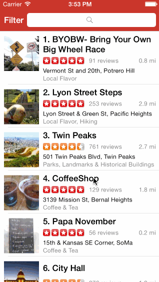

# Yelp
Yelp assignment for Codepath

Time spent: 14 hours

Completed user stories:

* [x] Required: User can see a list of businesses
* [x] Required: User can search for businesses
* [x] Required: The app uses the auto-layout feature to dynamically size rows
* [x] Required: The user can navigate to a Filters page
* [x] Required: The user can change filter settings and those affect the search
* [x] Required: Filter settings include: Category, Sort, Distance and Deals
* [x] Required: Filters are organized into categories
* [x] Optional: A filter class encapsulates the filter data to be passed around
* [x] Optional: Pressing on a business opens a webview with details

